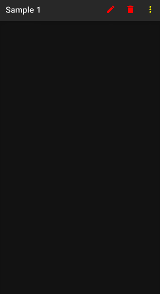

[](https://jitpack.io/#ceribe/compose-overflow-menu)

# Overflow Menu
Android library for Jetpack Compose providing an Overflow Menu via fast and easy to use DSL.



# How to add to project
### Step 1. Add the JitPack repository to your build file
Add it in your root build.gradle at the end of repositories:
```gradle
  allprojects {
     repositories {
       ....
       maven { url 'https://jitpack.io' }
     }
  }
```
### Step 2. Add the dependency
```gradle
  dependencies {
       implementation 'com.github.ceribe:compose-overflow-menu:version'
  }
```

# How to use
```kotlin 
OverflowMenu {
    shownIconsCount = 2 // How many icons will be shown on top app bar, rest will be hidden under overflow icon
    icons {
        icon {
            imageVector = Icons.Filled.Edit
            onClick = { context.toast("First Icon Clicked") }
        }
        icon {
            imageVector = Icons.Filled.Delete
            onClick = { context.toast("Second Icon Clicked") }
        }
        icon {
            label = "Third Example"
            onClick = { context.toast("Third Icon Clicked") }
        }
    }
    // Default values for icons. If icon does not have some parameter set it will use the one from defaults
    defaults {
        tint = Color.Red
    }
    // Parameters for overflow icon
    overflowIcon {
        tint = Color.Yellow
    }
}
```
### Possible icon parameters
- onClick - Lambda called when this icon is clicked
- modifier - Will be applied to Icon or DropdownMenuItem
- enabled - Will be applied to Icon or DropdownMenuItem
- imageVector - Will be applied to Icon
- label - Label used when this icon is hidden
- contentDescription - Will be applied to Icon
- tint - Will be applied to Icon


For more examples check [here](https://github.com/ceribe/compose-overflow-menu/blob/master/sample/src/main/java/com/ceribe/compose/sample/MainActivity.kt)
